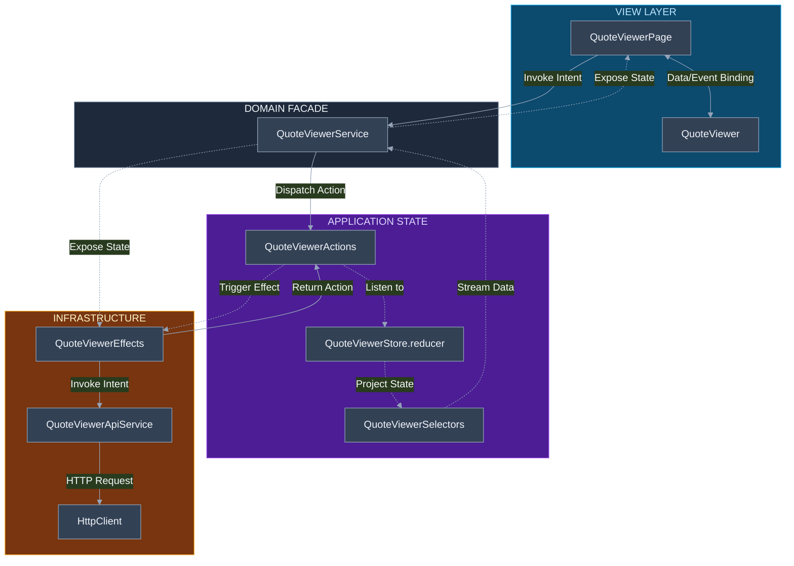

```mermaid
%%{init: {
  'theme': 'base',
  'themeVariables': {
    'background': '#0f172a',
    'primaryColor': '#1e293b',
    'primaryTextColor': '#f8fafc',
    'primaryBorderColor': '#334155',
    'lineColor': '#94a3b8'
  }
}}%%

graph
    %% Node Definitions
    A[QuoteViewerPage]:::nodeStyle
    B[QuoteViewer]:::nodeStyle
    C[QuoteViewerService]:::nodeStyle
    D[QuoteViewerSelectors]:::nodeStyle
    E[QuoteViewerStore.reducer]:::nodeStyle
    F[QuoteViewerActions]:::nodeStyle
    G[QuoteViewerEffects]:::nodeStyle
    H[QuoteViewerApiService]:::nodeStyle
    I[HttpClient]:::nodeStyle

    subgraph UI ["VIEW LAYER"]
        A <-->|Data/Event Binding| B
    end

    subgraph FACADE ["DOMAIN FACADE"]
        C
    end

    subgraph STATE ["APPLICATION STATE"]
        E -.->|Project State| D
        F -.->|Listen to| E
    end

    subgraph INFRA ["INFRASTRUCTURE"]
        G -->|Invoke Intent| H
        H -->|HTTP Request| I
    end

    %% Consistent Semantic Connections
    A -- "Invoke Intent" --> C
    C -. "Expose State" .-> A
    G -- "Return Action" --> F

    
    D -. "Stream Data" .-> C
    C -- "Dispatch Action" --> F
    
    F -. "Trigger Effect" .-> G
    C -. "Expose State" .-> G

    %% Style Classes
    classDef nodeStyle fill:#334155,stroke:#94a3b8,color:#f1f5f9,stroke-width:1px
    
    %% Layer Fills
    style UI fill:#0c4a6e,stroke:#0ea5e9,color:#bae6fd
    style FACADE fill:#1e293b,stroke:#94a3b8,color:#f1f5f9
    style STATE fill:#4c1d95,stroke:#a855f7,color:#ddd6fe
    style INFRA fill:#78350f,stroke:#f59e0b,color:#fef3c7
```
